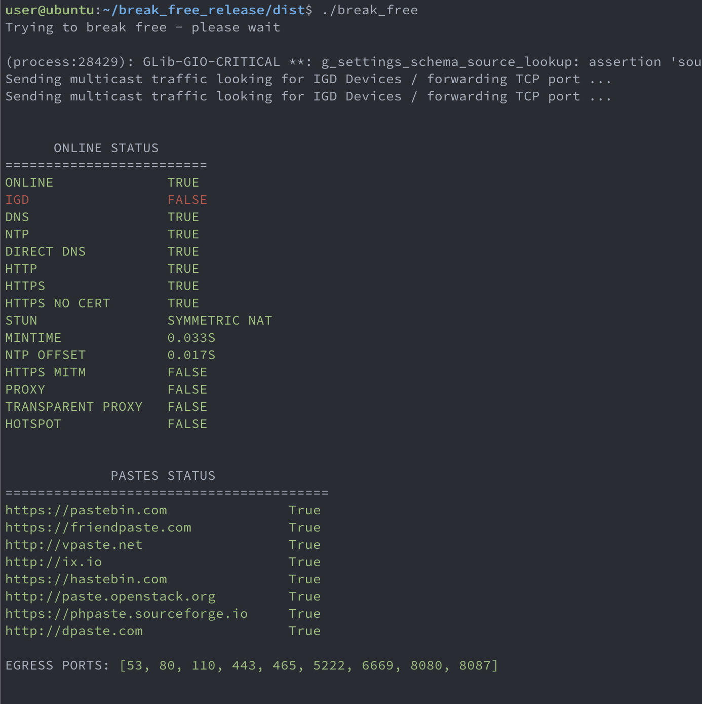
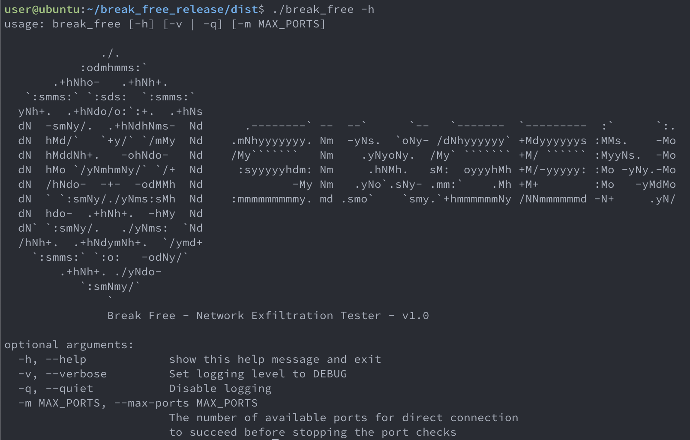

# Break Free - Network Exfiltration Tester
## Escaping Restricted Environments and Bypassing DLP

Break Free running in an unrestricted environment

Break Free is a network exfiltration tester to help red teams escape restricted environments and bypass data loss prevention (DLP) and help blue teams test their networks for potential exfiltration routes. Much of the code is from the [Pupy](https://github.com/n1nj4sec/pupy) project, which has been modified to perform as a stand alone tool. Binaries and hashes for Windows, Linux, and macOS are provided in the `binaries` directory, or can be created by running `pyinstaller --onefile break_free.py`.

Break Free tests for the following

* Exfiltration techniques:
	* IGD
	* DNS
	* Direct DNS Lookups (i.e. to a controlled DNS server)
	* HTTP
	* HTTPS
	* HTTPS Without Certificate Verification
	* STUN
	* 8 pastebin style sites
	* TCP to any port
* Network information:
	* Proxy
	* Transparent Proxy
	* Hotspot
	* HTTPS MITM
	* NTP Offset
